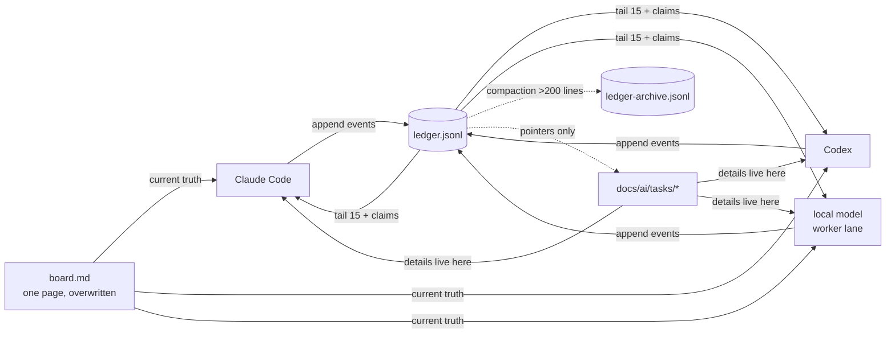

# Task — Agent bridge protocol (multi-agent coordination)

Date: 2026-07-02
Level: 2
Status: done

## User request

A governance layer that lets Claude work simultaneously with Codex and local models, communicating through files with detailed handoffs, without inflating context/tokens. Distribution zip extractable at project root, still readable by AIs.

## Acceptance criteria

- File-based coordination protocol with fixed, small per-session read cost.
- Handoffs are detailed *by pointer*: details in task files, notifications in a ledger.
- Works for Claude Code, Codex, Cursor and local models (plain files + bash, no infra).
- Token guardrails are mechanical, not aspirational (char caps, tail reads, compaction).
- Zip extracts at repo root.

## Structured task specification

```json
{
  "triage_status": "ready_for_implementation",
  "intent": "Make AGENTS.md §4 concrete via an event-ledger + board protocol",
  "task_level": "2",
  "description": "Add docs/ai/bridge/ (ledger.jsonl + board.md), scripts/bridge.sh, core/agent-bridge skill, local-model worker template; wire §4, skills list, memory list; bump 3.8→3.9; root-extractable zip.",
  "acceptance_criteria": ["see above"],
  "affected_files": {
    "owned": [
      "docs/ai/bridge/board.md", "docs/ai/bridge/ledger.jsonl",
      ".agents/skills/core/agent-bridge/SKILL.md", "scripts/bridge.sh",
      "prompt-templates/04-bridge-worker.txt", "AGENTS.md", "CLAUDE.md", "docs/ai/decision-log.md"
    ],
    "shared": [], "do_not_touch": ["other skills", "release-checklist.md"], "discovery_needed": []
  },
  "scope": {"in_scope": ["protocol", "script", "skill", "wiring"], "out_of_scope": ["MCP transport", "git hooks", "stale-claim automation"]},
  "gates_triggered": ["architecture-uml (light: new coordination surface)", "documentation"],
  "skills_to_load": ["core/context-memory", "core/documentation"],
  "context_packet_required": true,
  "task_file_required": true,
  "human_approval_required": {"required": false, "reason": "docs+tooling, reversible, no production impact"},
  "validation_plan": {
    "commands": ["bash -n scripts/bridge.sh", "functional test: init/log/claims/done-release/tail/140-char cap"],
    "manual_checks": ["cross-references resolve", "version strings consistent"],
    "quality_loop_max_attempts": 3
  },
  "missing_information": [],
  "routing_decision": "implement"
}
```

## Architecture notes

Event-log + materialized-view:



Claims are events (`claim`/`release`; `done` releases). No lockfiles, no infra, lowest-common-denominator files.

## Gates triggered

- [x] Architecture/UML — triggered (light): diagram above; boundaries = notification layer (ledger) vs state (board) vs detail (task files).
- [x] Code Quality/Testing — triggered: bridge.sh functionally tested (see Validation).
- [x] Security/Compliance — partially: skill forbids secrets/payloads in events; local-model lane denies governance files.
- [x] UX/Product — not applicable — reason: no product surface.
- [x] Data/Integration — not applicable — reason: local files only.
- [x] FinOps — triggered conceptually: the feature *is* a token-cost control; no paid resource added.
- [x] Observability/Release — not applicable — reason: no production change.
- [x] AI/LLM — triggered (light): worker template constrains small models; treats their output as executor-level, not planner-level.

## Validation

### Commands run

- `bash -n scripts/bridge.sh` — syntax OK.
- Functional: `init`, two `claim`s by different agents, `claims` resolution, `done` auto-release, `tail`, 140-char cap rejection — all behaved as specified. Test events purged; shipped ledger is empty.

### Not validated

- `compact` path exercised logically, not with a 200+ line ledger.
- Behavior on a machine without python3 (fallback prints raw events — degraded but functional by design).

## Risks and pending items

- Stale claims from dead sessions (mitigation documented in decision log).
- `bridge.sh stale` and per-commit git hook left as optional follow-ups.

## Final handoff

v3.9 makes §4 executable. Any agent booting in a multi-agent repo: `./scripts/bridge.sh board && ./scripts/bridge.sh tail 15 && ./scripts/bridge.sh claims`, then only the relevant task file.
