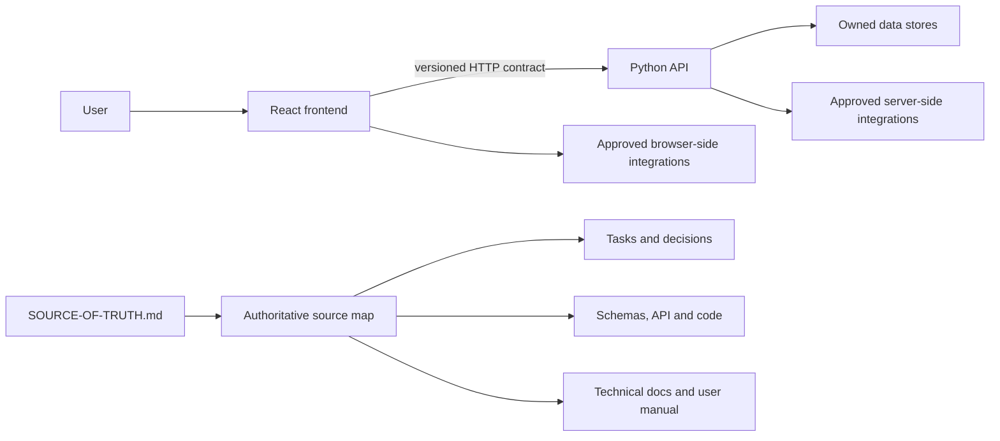

# Harness v6 hybrid engineering architecture

Status: approved design, implementation evidence pending.

## Outcome and scope

Harness v6 specializes application generation around two isolated deployable boundaries: a Python HTTP API and a React client. It adds a safe structural bootstrap, a machine architecture contract, a root truth index, and release documentation contracts while preserving tasks, gates, decisions, schemas, tests, and detailed documentation as separate authoritative sources.

## System boundaries

The frontend never imports or executes Python modules. The backend never renders or owns React presentation behavior. Integration occurs through an explicit HTTP contract, normally OpenAPI, with authentication, authorization, validation, error, versioning, timeout, and CORS behavior documented at the boundary.

## Minimum extensible topology

- Backend minimum: `backend/app/controllers`, `services`, `models`, `schemas`, and `repositories`, plus a thin `main.py` composition root and tests.
- Frontend minimum: `frontend/src/api`, `assets`, `components/layout`, `components/ui`, `context`, `data`, `hooks`, `pages`, `services`, and `utils`, plus tests.
- Additional directories are allowed. New architectural layers must declare responsibility, permitted dependencies, and ownership in the architecture policy or conventions.
- Minimum paths are a required subset, not an allowlist.

Dependency direction is `controllers -> services -> models/repositories`. Controllers own transport mapping, not business logic or persistence. React `api` owns transport; frontend `services` own presentation-side orchestration, never authoritative server rules. Utilities remain pure and must not depend on pages or transport.

## Entrypoints and anti-monolith rule

`main.py`, `server.py`, `App.jsx`, and `App.tsx` are permitted only for composition: application construction, router/provider registration, middleware, layout, and route assembly. Route implementations, database access, HTTP calls, business rules, large state machines, feature data, and reusable visual components belong in their owned modules.

The model must reject a request to centralize application behavior and propose a compliant decomposition. Static checks use structural rules, Python AST, import direction, entrypoint budgets, and conservative forbidden-responsibility signals. Because static heuristics cannot prove design quality, release also requires tests and architecture review.

## Bootstrap and collision behavior

The release package contains `project-templates/python-react-hybrid/`; it does not place application folders directly beside Harness files. Bootstrap defaults to a read-only plan. Apply performs a full preflight, writes only missing template files, never overwrites differing content, and stops before writes on unresolved collision unless the operator explicitly chooses the documented non-overwriting merge mode.

Python package directories use `__init__.py`. Empty frontend responsibility directories use `.gitkeep`; their responsibilities live once in `docs/architecture/DIRECTORY-MAP.md` to avoid repetitive drifting files.

## Truth and documentation ownership

`SOURCE-OF-TRUTH.md` owns the map of current project identity, release, architecture profile, material contracts, authoritative pointers, active work, current risks, and last qualified evidence. A missing material fact is unverified, not automatically false; it must be reconciled before destructive or incompatible work. Authority remains platform/user, then `AGENTS.md`, then the indexed verified project sources.

`docs/TECHNICAL-DOCUMENTATION.md` and `docs/USER-MANUAL.md` are canonical entrypoints and may link to focused subdocuments. Tasks classify documentation impact as none, technical, user manual, or both. Official release blocks on incomplete, stale, placeholder-filled, or unresolved documentation.

## Failure and rollback

- Missing minimum structure, reversed dependency, monolithic entrypoint, invalid truth index, or incomplete release documentation produces a typed failure or incomplete result; zero applicable checks is never a pass.
- Bootstrap collision is reported before mutation.
- The v5.0 archive remains the rollback artifact. Migration is opt-in and documented; no automatic overwrite occurs.

## Compatibility

This is a major policy release. Existing v5 task, GateResult, and bridge records remain readable, but v6-generated application architecture and release documentation requirements are intentionally stricter. Migration guidance must distinguish new projects, already compliant projects, and legacy monoliths.

## Rejected alternatives

- Patching v5.0: rejected because releases are immutable and the change is breaking.
- Placing `backend/` and `frontend/` directly in the Harness archive root: rejected because safe installation requires deliberate merge and collision review.
- A Markdown placeholder in every application directory: rejected because duplicated responsibility prose drifts; use package markers plus one directory map.
- Treating `SOURCE-OF-TRUTH.md` as the sole detailed truth: rejected because it would duplicate tasks, schemas, code, tests, decisions, and operational documentation.
- Guidance-only enforcement: rejected because prompts cannot reliably block structural regressions without machine checks and negative fixtures.

## Conditions before release

- Close all design findings with implemented schemas, scripts, fixtures, prompts, docs, and clean-package evidence.
- Verify current runtime/framework references before recording supported versions.
- Demonstrate valid thin entrypoints and invalid monoliths without false claims of complete semantic proof.
- Run deterministic packaging twice and validate a fresh extraction.
