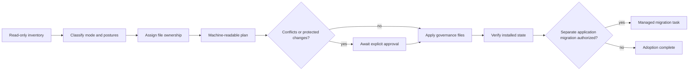
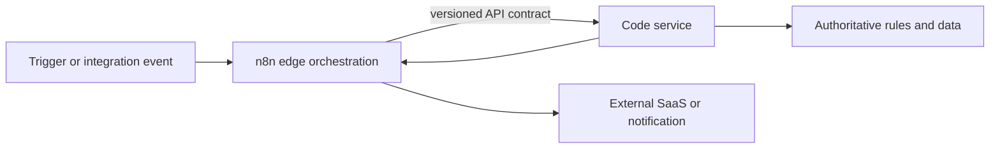

# Harness v7 adoption and automation architecture

Status: approved design; implementation evidence pending.

## Outcome

Harness v7 treats project adoption and automation placement as explicit, machine-readable decisions. Installing governance never silently initializes application code or migrates architecture.

## Adoption state and ownership

Adoption uses independent axes: `adoption_mode` (`greenfield`, `brownfield`, `upgrade`), Harness posture, application posture, and architecture conformance. This avoids inferring a project rewrite merely from a missing or old Harness.

Harness-owned distribution files may be created or upgraded from a trusted source baseline. Project-owned memory, tasks, decisions, bridge history, product documentation, and application code are never overwritten. Shared policy files require an explicit merge decision. Apply uses the exact reviewed plan digest and fails on target drift.

## Automation execution planes

Hard blockers route an automation to code: authoritative authorization or tenant rules, financial or transactional invariants, strict latency/throughput, complex concurrency/state, intensive computation, or inability to satisfy production controls. A hybrid decision extracts those responsibilities behind a versioned API while retaining visual orchestration at the edge.

## Contracts and failure behavior

- `automation-decision` records execution plane, triggers, authority, hard blockers, eligibility, data/reliability/security/operations/cost controls, evidence, and approval.
- `adoption-plan` records source identity, target identity, postures, ownership, operations, conflicts, approvals, plan digest, and state.
- `plan` is read-only. `apply` accepts only a reviewed plan whose source and target fingerprints still match. `verify` performs no writes.
- Brownfield discovery cannot return `NOT_APPLICABLE` merely because expected Python/React directories are absent; unknown architecture is `observed` or `migration_required`.
- A Harness upgrade cannot change application architecture. Architecture migration needs its own managed task and rollback plan.

## Compatibility and rollback

V6 task, GateResult, bridge, security, UI, and project-template contracts remain readable. V7 adds versioned contracts rather than mutating old instances. The v6 archive and digest remain the Harness rollback artifact. Product changes, if separately migrated, require a project-specific rollback.

## Rejected alternatives

- Patch v6.0: rejected because released baselines are immutable and admission behavior changes materially.
- Reuse `bootstrap_project.py` for Harness installation: rejected because application templates and governance files have different ownership and migration rules.
- Automatically adapt brownfield code to Python/React: rejected because stack migration is a separate, high-impact product decision.
- Permit n8n whenever a connector exists: rejected because connector availability does not establish domain ownership, reliability, security, cost, or audit suitability.
- Add third-party dependencies: rejected because the standard library is sufficient for bounded local planning, hashing, schemas, and file writes.

## Release conditions

Policy, schemas, prompts, validators, tests, migration, packaging, technical documentation, user manual, manifest, SBOM, provenance, and clean extraction must agree. Missing external n8n deployment evidence remains downstream-specific and cannot be represented as passed.
